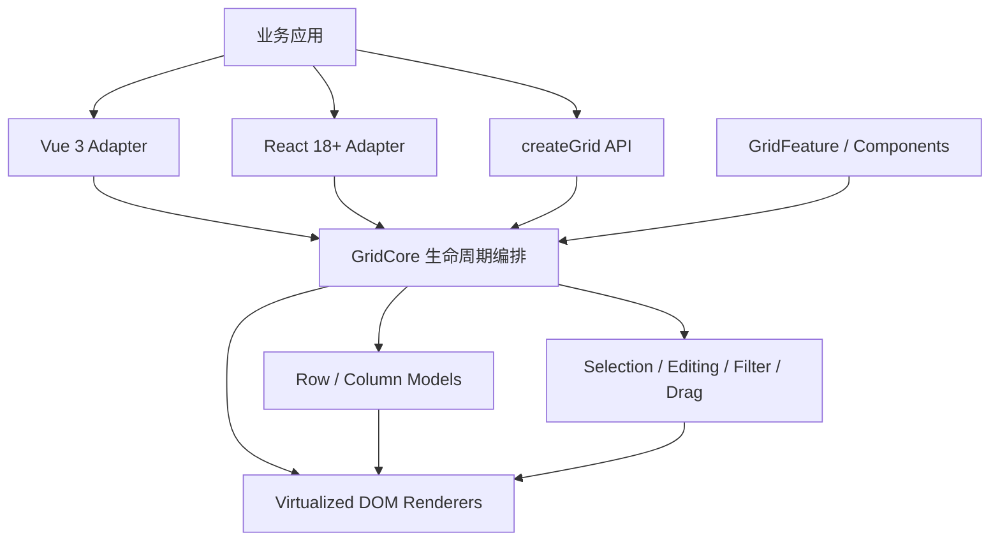

<p align="center">
  
</p>

<p align="center">
  <strong>面向复杂业务的高性能 TypeScript 数据表格。</strong><br />
  框架无关内核，Vue 3 优先，React 18+ 官方支持。
</p>

<p align="center">
  
  <a href="https://www.npmjs.com/package/@agile-team/mach-table"></a>
  <a href="https://github.com/ChenyCHENYU/MachTable/actions/workflows/ci.yml"></a>
  <a href="./LICENSE"></a>
  
  
</p>

<p align="center">
  <a href="./docs/guide/getting-started.md"><strong>快速开始</strong></a> ·
  <a href="./docs/guide/enterprise-integration.md"><strong>企业接入手册</strong></a> ·
  <a href="./docs/guide/vue.md">Vue 3</a> ·
  <a href="./docs/guide/react.md">React</a> ·
  <a href="./docs/api/grid-options.md">API</a> ·
  <a href="./examples">示例</a> ·
  <a href="./LICENSING.md">授权说明</a>
</p>

---

## 为什么选择 MachTable

MachTable 为后台管理、工业台账、财务报表、订单工单和低代码平台提供完整的数据网格能力，同时保持内核小、依赖少、扩展边界清晰。

| 你需要的能力 | MachTable 的实现 |
| --- | --- |
| 大数据量稳定滚动 | 行/列双虚拟化、行池复用、rAF 合帧、变高行前缀和定位 |
| Excel 式操作 | 框选、复制/剪切/粘贴、Delete、填充柄、撤销/重做 |
| 企业级数据模型 | 排序、四类过滤、受控远程分页、请求取消/重试、查询级全选、树形、分组聚合、主从明细 |
| 复杂布局 | 左右固定列、多级表头、变高行、固定首末行、行列拖拽、行合并 |
| 业务组件集成 | Vue 原生 cell/header/editor/overlay/detail/actions 插槽、React 适配器、自定义编辑器 |
| 长期可维护 | 分层配置与来源解释、版本化状态迁移、托管 `GridFeature`、稳定错误码与运行时校验 |
| 复杂编辑流程 | 精致单元格就地编辑、原子化整行编辑、同步/异步校验、脏数据、保存与回滚 |
| 操作列 | 查看/编辑/删除图标、整行对勾/取消、任意业务动作、菜单/抽屉/全部展开 |
| 安全与治理 | 安全 Overlay 默认值、CSV 公式注入防护、原型污染防护、体积/覆盖率门禁 |

## 60 秒开始

### Vue 3（推荐）

```bash
pnpm add @agile-team/mach-table-vue
```

```vue
<script setup lang="ts">
import { ref } from "vue";
import { MachTable, useMachTable, type ColDef } from "@agile-team/mach-table-vue";
import "@agile-team/mach-table-vue/styles.css";

interface Order {
  id: string;
  customer: string;
  amount: number;
  status: "待处理" | "已完成";
}

const grid = useMachTable<Order>();
const rows = ref<Order[]>([
  { id: "SO-001", customer: "Acme", amount: 12800, status: "待处理" }
]);

const columns: ColDef<Order>[] = [
  { colId: "select", width: 46, checkboxSelection: true, pinned: "left" },
  { field: "id", headerName: "订单号", width: 130, pinned: "left" },
  { field: "customer", headerName: "客户", flex: 1, editable: true, filter: "text" },
  { field: "amount", headerName: "金额", width: 140, filter: "number", type: "rightAligned" },
  { field: "status", headerName: "状态", width: 120, filter: "set" }
];
</script>

<template>
  <div style="height: 560px">
    <MachTable
      :ref="grid.ref"
      :column-defs="columns"
      :row-data="rows"
      :get-row-id="({ data }) => data.id"
      row-selection="multiple"
      striped-rows
    />
  </div>
</template>
```

### React 18+

```bash
pnpm add @agile-team/mach-table-react
```

```tsx
import { MachTable, useMachGrid, type ColDef } from "@agile-team/mach-table-react";
import "@agile-team/mach-table-react/styles.css";

interface Order { id: string; customer: string; amount: number }

export function OrdersPage({ rows }: { rows: Order[] }) {
  const grid = useMachGrid<Order>();
  const columns: ColDef<Order>[] = [
    { field: "id", headerName: "订单号", width: 130, pinned: "left" },
    { field: "customer", headerName: "客户", flex: 1, editable: true },
    { field: "amount", headerName: "金额", width: 140, filter: "number" }
  ];

  return (
    <div style={{ height: 560 }}>
      <MachTable<Order>
        apiRef={grid.apiRef}
        columnDefs={columns}
        rowData={rows}
        getRowId={({ data }) => data.id}
      />
    </div>
  );
}
```

### 原生 TypeScript / JavaScript

```bash
pnpm add @agile-team/mach-table
```

```ts
import { createGrid } from "@agile-team/mach-table";
import "@agile-team/mach-table/styles/mach-table.css";

const api = createGrid(document.querySelector("#grid")!, {
  columnDefs: [{ field: "name", headerName: "名称", flex: 1 }],
  rowData: [{ id: "1", name: "MachTable" }],
  getRowId: ({ data }) => data.id
});

// 原生接入需在宿主销毁时调用；Vue/React 适配器会自动处理。
api.destroy();
```

> 容器必须有明确高度，并且必须引入主题 CSS。完整的生产项目配置、SSR、错误治理、状态持久化和上线检查见[企业级项目接入手册](./docs/guide/enterprise-integration.md)。

## 全局注入与按需加载

主题 CSS 只需在应用入口引入一次。Vue 组件支持三种模式，业务可按表格覆盖面选择：

| 模式 | 页面是否 import 组件 | JS 加载时机 | 适合场景 |
| --- | --- | --- | --- |
| 局部导入 | 是 | 所属路由加载时 | 只有少量表格页面 |
| 全局同步插件 | 否 | 应用启动时 | 大多数页面都有表格 |
| 全局异步插件 | 否 | 首次渲染 `<MachTable>` 时 | 中后台平台、低代码平台，推荐 |

```ts
// main.ts：全局注册名称和类型均已提供，页面无需运行时 import。
import { createApp } from "vue";
import AsyncMachTablePlugin, { preloadMachTable } from "@agile-team/mach-table-vue/async";
import "@agile-team/mach-table-vue/styles.css";
import App from "./App.vue";

createApp(App).use(AsyncMachTablePlugin).mount("#app");

// 可选：在路由 hover/预取阶段提前加载，首次进入页面更顺滑。
void preloadMachTable();
```

建议把全局约定单独放进配置文件，入口只保留一行，页面仍可用 props 覆盖：

```ts
// src/config/mach-table.config.ts
import {
  createBusinessColumnTypes,
  defineMachTableConfig,
  defineMachTablePreset
} from "@agile-team/mach-table-vue";

export default defineMachTableConfig({
  defaults: {
    size: "compact",
    columnLayout: "fit",
    pagination: { pageSize: 20, pageSizeOptions: [20, 50, 100] },
    defaultColDef: { sortable: true, resizable: true, filter: true },
    onGridError: ({ code, error }) => telemetry.captureException(error, { tags: { code } })
  },
  defaultPreset: "list",
  presets: {
    list: defineMachTablePreset({ stripedRows: true, columnMenu: true }),
    crud: defineMachTablePreset({ rowSelection: "multiple", editType: "fullRow" })
  },
  columnTypes: createBusinessColumnTypes({
    locale: "zh-CN",
    currency: "CNY",
    timeZone: "Asia/Shanghai"
  })
});

// main.ts
import machTableConfig from "@/config/mach-table.config";
createApp(App).use(AsyncMachTablePlugin, machTableConfig).mount("#app");
```

路由或布局还可通过响应式 `provideMachTableConfig(...)` 叠加局部约定；命名预设、覆盖顺序与配置来源诊断见[配置中心](./docs/guide/configuration.md)。

注册后任意 Vue 页面直接使用：

```vue
<template>
  <MachTable :column-defs="columns" :row-data="rows" />
</template>
```

React 没有全局组件注册惯例。包提供默认组件导出，可直接使用标准 `React.lazy`，并由路由级 `<Suspense>` 控制加载状态：

```tsx
import { lazy, Suspense } from "react";
import "@agile-team/mach-table-react/styles.css";

const MachTable = lazy(() => import("@agile-team/mach-table-react"));

export function Orders() {
  return <Suspense fallback={<div>Loading table...</div>}><MachTable columnDefs={columns} rowData={rows} /></Suspense>;
}
```

跨页面统一默认值使用类型安全的 Provider，单表 props 优先：

```tsx
<MachTableProvider defaults={{ size: "compact", pagination: false }}>
  <App />
</MachTableProvider>
```

## 功能全景

| 数据与性能 | 交互与编辑 | 布局与呈现 | 工程与扩展 |
| --- | --- | --- | --- |
| 行/列虚拟化 | 单/多选、Ctrl/Shift | 左右固定列 | Vue 3 / React 18+ |
| 客户端排序过滤 | 单元格/整行编辑 | 多级分组表头 | TypeScript 类型 |
| 服务端排序过滤 | 原子校验、自定义编辑器 | 列宽拖拽与自适应 | 组件注册表 |
| 无限滚动数据源 | Undo / Redo | 行列拖拽 | `GridFeature` 插件 |
| 分页与同步/异步事务 | 框选与剪贴板 | 变高行与换行 | Schema 驱动、类型化列助手 |
| 树形与分组聚合 | 填充柄、右键菜单 | 行合并、固定行 | i18n、主题令牌 |
| 主从明细 | Tooltip、状态栏 | 明暗主题与密度 | 状态持久化 |
| CSV 导入导出 | 图标操作列、菜单/抽屉 | 空态/加载态/水印 | 全量状态、诊断与稳定错误码 |

## 为框架适配，也为包体积负责

MachTable 不是把 Vue、React 和全部功能塞进一个包。内核与适配层独立发布；适配包自动安装 Core 并重新导出完整核心 API，框架本身仍保持 peer dependency：

| 包 | 用途 | gzip 预算 / 当前值 |
| --- | --- | --- |
| `@agile-team/mach-table` | 零运行时依赖 Core、原生 API、主题 CSS | 80 KB / 约 65.4 KB |
| `@agile-team/mach-table-vue` | Vue 3 单包入口；自动安装 Core，含局部/全局同步/全局异步模式 | 全部产物 8 KB / 约 7.7 KB；工作流入口约 2.8 KB |
| `@agile-team/mach-table-react` | React 单包入口；自动安装 Core，含组件、Hook、类型和样式入口 | 5 KB / 约 1.4 KB（适配代码） |

Vue 用户只需安装 Vue 包，React 用户只需安装 React 包；Vue 项目不会安装 React，React 项目也不会安装 Vue。原生项目仍可单独使用 Core。

远程查询与编辑仍可从 Vue 根入口导入；追求最小业务 chunk 时从同包的 `@agile-team/mach-table-vue/workflows` 子入口导入，不增加第二个安装依赖。

## 架构



- 状态型能力使用明确生命周期的 class Service；它适合封装资源所有权、缓存和销毁边界。
- 排序、过滤、布局、预设合并和编解码保持为纯函数；函数式并非被替代，而是用于无状态逻辑。
- 业务扩展通过 `GridFeature` 与实例级组件组合完成，不建议继承 `GridCore`。这种“有状态用类、算法用函数、扩展用组合”的混合架构比全类或全函数更容易长期维护。
- `GRID_OPTION_META` 是 Core、Vue 和 React 运行时配置的单一事实源。

更多细节见[架构说明](./docs/advanced/architecture.md)。

## 企业级质量基线

- Core、Vue、React 共 230+ 个单元测试，并包含重复挂载/销毁的监听器泄漏检查。
- Chromium、Firefox、WebKit 覆盖 Vanilla、Vue、React 的键盘、编辑和过滤交互；Chromium 额外执行 10 万行 × 100 列性能预算。
- ESLint、TypeScript、覆盖率阈值、publint、真实消费端类型检查、ESM/CJS exports、gzip 预算、示例与文档构建统一进入 `pnpm verify`。
- Overlay 字符串默认按文本渲染；可信 HTML 必须显式开启 `allowUnsafeOverlayHtml`。
- 所有框架渲染器、编辑器、Feature、全局监听器和异步数据源都有销毁/取消边界。
- CSV 导出默认防公式注入，字段路径写入拒绝危险原型键。

```bash
pnpm install
pnpm verify
pnpm exec playwright install chromium firefox webkit
pnpm test:e2e
```

## 文档地图

| 目标 | 文档 |
| --- | --- |
| 第一次接入 | [快速开始](./docs/guide/getting-started.md) |
| 企业项目落地 | [企业级项目接入手册](./docs/guide/enterprise-integration.md) |
| Vue / React | [Vue 3](./docs/guide/vue.md) · [React](./docs/guide/react.md) |
| Nuxt / Next.js | [SSR 与客户端挂载](./docs/guide/ssr.md) |
| 配置与命令 | [GridOptions](./docs/api/grid-options.md) · [GridApi](./docs/api/grid-api.md) |
| 列与事件 | [ColDef](./docs/api/col-def.md) · [Events](./docs/api/events.md) |
| 高频业务 | [场景配方](./docs/recipes/selection.md) |
| 竞品与后续规划 | [竞品分析](./docs/advanced/competitive-analysis.md) · [AG Grid 源码审计](./docs/advanced/ag-grid-source-study.md) · [路线图](./docs/advanced/roadmap.md) |
| 故障定位 | [排错手册](./docs/guide/troubleshooting.md) |
| 版本升级 | [升级指南](./docs/guide/upgrading.md) · [Changelog](./packages/core/CHANGELOG.md) |

## 浏览器与版本

- Vue `>= 3.2`
- React / React DOM `>= 18`
- Chrome / Edge `>= 88`、Firefox `>= 89`、Safari `>= 14`
- 包运行时面向浏览器；仓库开发使用 Node.js `>= 22.22.2` 与 pnpm `11.8.0`
- 当前源码版本为 `0.10.0`，仍处于 0.x 打磨阶段，不发布 `1.0.0`。`MachTable` 是规范名称，`RobotGrid` 仅作为 0.x 兼容别名保留；破坏性调整只通过 minor 版本发布，并在 Changelog 与升级指南中说明。

## 参与贡献

提交代码前请先阅读[架构边界](./docs/advanced/architecture.md)。新增配置必须登记到 `GRID_OPTION_META`，服务改动必须补测试，可选业务能力优先实现为 `GridFeature`，Core 不接受新增运行时依赖。

问题与建议请通过 [GitHub Issues](https://github.com/ChenyCHENYU/MachTable/issues) 提交。

## License

MachTable 从 `0.9.1` 起采用 [MachTable Source-Available License 1.0](./LICENSE)：源码公开可查看，但不是 OSI 定义下的开源软件。任何安装、运行、测试、修改、集成、部署、分发或商业使用均须事先取得作者书面授权。申请流程见[授权说明](./LICENSING.md)。

历史上已按 MIT 文本公开的版本保留其当时的授权事实；旧版许可不延伸到 `0.9.1` 及后续版本。
