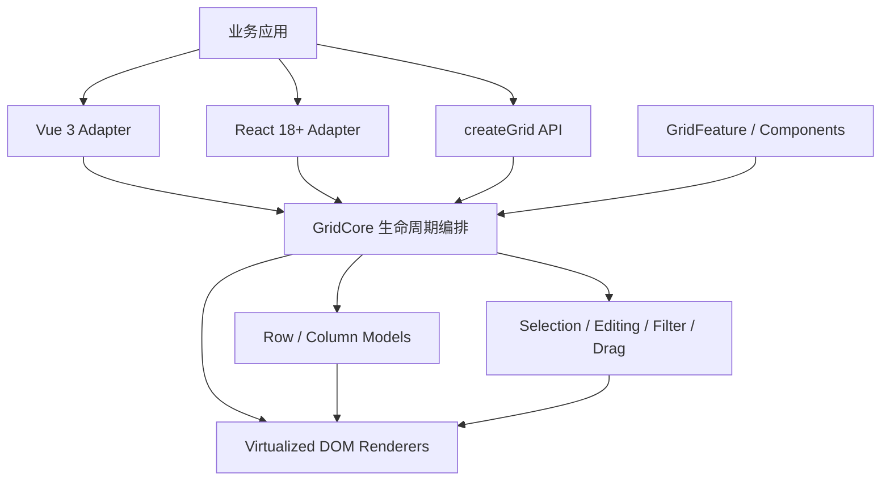

<p align="center">
  
</p>

<p align="center">
  <strong>面向复杂业务的高性能 TypeScript 数据表格。</strong><br />
  框架无关内核，Vue 3 优先，React 18+ 官方支持。
</p>

<p align="center">
  <a href="https://www.npmjs.com/package/@agile-team/mach-table"></a>
  <a href="https://github.com/ChenyCHENYU/MachTable/actions/workflows/ci.yml"></a>
  <a href="./LICENSE"></a>
  
  
</p>

<p align="center">
  <a href="./docs/guide/getting-started.md"><strong>快速开始</strong></a> ·
  <a href="./docs/guide/enterprise-integration.md"><strong>企业接入手册</strong></a> ·
  <a href="./docs/guide/vue.md">Vue 3</a> ·
  <a href="./docs/guide/react.md">React</a> ·
  <a href="./docs/api/grid-options.md">API</a> ·
  <a href="./examples">示例</a>
</p>

---

## 为什么选择 MachTable

MachTable 为后台管理、工业台账、财务报表、订单工单和低代码平台提供完整的数据网格能力，同时保持内核小、依赖少、扩展边界清晰。

| 你需要的能力 | MachTable 的实现 |
| --- | --- |
| 大数据量稳定滚动 | 行/列双虚拟化、行池复用、rAF 合帧、变高行前缀和定位 |
| Excel 式操作 | 框选、复制/剪切/粘贴、Delete、填充柄、撤销/重做 |
| 企业级数据模型 | 排序、四类过滤、分页、无限数据源、树形、分组聚合、主从明细 |
| 复杂布局 | 左右固定列、多级表头、变高行、固定首末行、行列拖拽、行合并 |
| 业务组件集成 | Vue/React 单元格与明细适配器、自定义编辑器、实例级组件注册表 |
| 长期可维护 | TypeScript 全量类型、组合式 `GridFeature`、生命周期清理、错误事件 |
| 安全与治理 | 安全 Overlay 默认值、CSV 公式注入防护、原型污染防护、体积/覆盖率门禁 |

## 60 秒开始

### Vue 3（推荐）

```bash
pnpm add @agile-team/mach-table-vue
```

```vue
<script setup lang="ts">
import { ref } from "vue";
import { MachTable, useMachTable, type ColDef } from "@agile-team/mach-table-vue";
import "@agile-team/mach-table-vue/styles.css";

interface Order {
  id: string;
  customer: string;
  amount: number;
  status: "待处理" | "已完成";
}

const grid = useMachTable<Order>();
const rows = ref<Order[]>([
  { id: "SO-001", customer: "Acme", amount: 12800, status: "待处理" }
]);

const columns: ColDef<Order>[] = [
  { colId: "select", width: 46, checkboxSelection: true, pinned: "left" },
  { field: "id", headerName: "订单号", width: 130, pinned: "left" },
  { field: "customer", headerName: "客户", flex: 1, editable: true, filter: "text" },
  { field: "amount", headerName: "金额", width: 140, filter: "number", type: "rightAligned" },
  { field: "status", headerName: "状态", width: 120, filter: "set" }
];
</script>

<template>
  <div style="height: 560px">
    <MachTable
      :ref="grid.ref"
      :column-defs="columns"
      :row-data="rows"
      :get-row-id="({ data }) => data.id"
      row-selection="multiple"
      striped-rows
    />
  </div>
</template>
```

### React 18+

```bash
pnpm add @agile-team/mach-table-react
```

```tsx
import { MachTable, useMachGrid, type ColDef } from "@agile-team/mach-table-react";
import "@agile-team/mach-table-react/styles.css";

interface Order { id: string; customer: string; amount: number }

export function OrdersPage({ rows }: { rows: Order[] }) {
  const grid = useMachGrid<Order>();
  const columns: ColDef<Order>[] = [
    { field: "id", headerName: "订单号", width: 130, pinned: "left" },
    { field: "customer", headerName: "客户", flex: 1, editable: true },
    { field: "amount", headerName: "金额", width: 140, filter: "number" }
  ];

  return (
    <div style={{ height: 560 }}>
      <MachTable<Order>
        apiRef={grid.apiRef}
        columnDefs={columns}
        rowData={rows}
        getRowId={({ data }) => data.id}
      />
    </div>
  );
}
```

### 原生 TypeScript / JavaScript

```bash
pnpm add @agile-team/mach-table
```

```ts
import { createGrid } from "@agile-team/mach-table";
import "@agile-team/mach-table/styles/mach-table.css";

const api = createGrid(document.querySelector("#grid")!, {
  columnDefs: [{ field: "name", headerName: "名称", flex: 1 }],
  rowData: [{ id: "1", name: "MachTable" }],
  getRowId: ({ data }) => data.id
});

// 原生接入需在宿主销毁时调用；Vue/React 适配器会自动处理。
api.destroy();
```

> 容器必须有明确高度，并且必须引入主题 CSS。完整的生产项目配置、SSR、错误治理、状态持久化和上线检查见[企业级项目接入手册](./docs/guide/enterprise-integration.md)。

## 功能全景

| 数据与性能 | 交互与编辑 | 布局与呈现 | 工程与扩展 |
| --- | --- | --- | --- |
| 行/列虚拟化 | 单/多选、Ctrl/Shift | 左右固定列 | Vue 3 / React 18+ |
| 客户端排序过滤 | 双击/单击/键盘编辑 | 多级分组表头 | TypeScript 类型 |
| 服务端排序过滤 | 校验、自定义编辑器 | 列宽拖拽与自适应 | 组件注册表 |
| 无限滚动数据源 | Undo / Redo | 行列拖拽 | `GridFeature` 插件 |
| 分页与事务更新 | 框选与剪贴板 | 变高行与换行 | Schema 驱动 |
| 树形与分组聚合 | 填充柄、右键菜单 | 行合并、固定行 | i18n、主题令牌 |
| 主从明细 | Tooltip、状态栏 | 明暗主题与密度 | 状态持久化 |
| CSV 导入导出 | 操作列预设 | 空态/加载态/水印 | 统一错误事件 |

## 为框架适配，也为包体积负责

MachTable 不是把 Vue、React 和全部功能塞进一个包。内核与适配层独立发布；适配包自动安装 Core 并重新导出完整核心 API，框架本身仍保持 peer dependency：

| 包 | 用途 | gzip 预算 / 当前值 |
| --- | --- | --- |
| `@agile-team/mach-table` | 零运行时依赖 Core、原生 API、主题 CSS | 80 KB / 约 66 KB |
| `@agile-team/mach-table-vue` | Vue 3 单包入口；自动安装 Core，含组件、Composable、类型和样式入口 | 5 KB / 约 1.7 KB（适配代码） |
| `@agile-team/mach-table-react` | React 单包入口；自动安装 Core，含组件、Hook、类型和样式入口 | 5 KB / 约 1.5 KB（适配代码） |

Vue 用户只需安装 Vue 包，React 用户只需安装 React 包；Vue 项目不会安装 React，React 项目也不会安装 Vue。原生项目仍可单独使用 Core。

## 架构



- 状态型能力使用明确生命周期的 Service。
- 排序、过滤、布局和编解码等逻辑保持为纯函数或独立状态模型。
- 业务扩展通过 `GridFeature` 和实例级组件完成，不依赖继承 `GridCore`。
- `GRID_OPTION_META` 是 Core、Vue 和 React 运行时配置的单一事实源。

更多细节见[架构说明](./docs/advanced/architecture.md)。

## 企业级质量基线

- Core、Vue、React 共 209 个单元测试。
- Chromium、Firefox、WebKit 覆盖 Vanilla、Vue、React 三套真实页面。
- ESLint、TypeScript、覆盖率阈值、publint、gzip 预算、示例构建和文档构建统一进入 `pnpm verify`。
- Overlay 字符串默认按文本渲染；可信 HTML 必须显式开启 `allowUnsafeOverlayHtml`。
- 所有框架渲染器、编辑器、Feature、全局监听器和异步数据源都有销毁/取消边界。
- CSV 导出默认防公式注入，字段路径写入拒绝危险原型键。

```bash
pnpm install
pnpm verify
pnpm exec playwright install chromium firefox webkit
pnpm test:e2e
```

## 文档地图

| 目标 | 文档 |
| --- | --- |
| 第一次接入 | [快速开始](./docs/guide/getting-started.md) |
| 企业项目落地 | [企业级项目接入手册](./docs/guide/enterprise-integration.md) |
| Vue / React | [Vue 3](./docs/guide/vue.md) · [React](./docs/guide/react.md) |
| Nuxt / Next.js | [SSR 与客户端挂载](./docs/guide/ssr.md) |
| 配置与命令 | [GridOptions](./docs/api/grid-options.md) · [GridApi](./docs/api/grid-api.md) |
| 列与事件 | [ColDef](./docs/api/col-def.md) · [Events](./docs/api/events.md) |
| 高频业务 | [场景配方](./docs/recipes/selection.md) |
| 故障定位 | [排错手册](./docs/guide/troubleshooting.md) |
| 版本升级 | [升级指南](./docs/guide/upgrading.md) · [Changelog](./packages/core/CHANGELOG.md) |

## 浏览器与版本

- Vue `>= 3.2`
- React / React DOM `>= 18`
- Chrome / Edge `>= 88`、Firefox `>= 89`、Safari `>= 14`
- 包运行时面向浏览器；仓库开发使用 Node.js `>= 22.22.2` 与 pnpm `11.8.0`
- 当前版本为 `0.4.1`。在 `1.0.0` 前，破坏性调整只通过 minor 版本发布，并在 Changelog 与升级指南中说明。

## 参与贡献

提交代码前请先阅读[架构边界](./docs/advanced/architecture.md)。新增配置必须登记到 `GRID_OPTION_META`，服务改动必须补测试，可选业务能力优先实现为 `GridFeature`，Core 不接受新增运行时依赖。

问题与建议请通过 [GitHub Issues](https://github.com/ChenyCHENYU/MachTable/issues) 提交。

## License

[MIT](./LICENSE) © Agile Team
